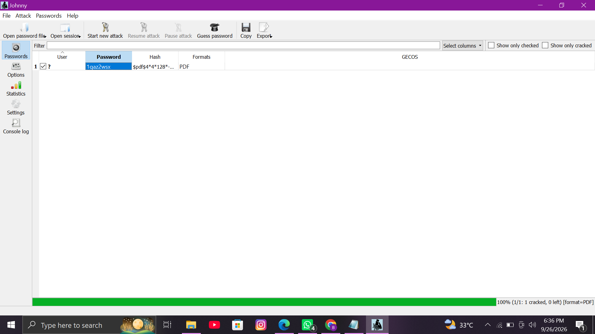

# Password-Cracking-Labs

Practical write-ups documenting my work from the **NetworkWalks Academy Cybersecurity & Ethical Hacking** training program. This module focuses on password auditing techniques using a password-protected PDF in an authorized lab environment.

> ⚠️ **Scope & Ethics Note:**  
> All activities documented here were performed in an authorized learning environment using a training PDF provided for cybersecurity practice. Password-cracking techniques should only be used on files, systems, or resources that you own or have explicit permission to test.

---

## Background

Password auditing is the process of testing how resistant a password-protected file or system is to password-guessing techniques.

In this practical module, a protected PDF was analyzed by extracting its crackable hash and testing password candidates through dictionary-based attacks. The exercises demonstrate both a traditional offline approach and a browser-based approach.

### Target File

- **File:** `My-Locked-PDF3.pdf`
- **File Size:** `313.5 KB`
- **File Type:** Password-Protected PDF
- **Encryption:** PDF Encryption Revision 4 (V4)
- **Key Length:** 128-bit

---

## Lab 1 — Password Auditing with John the Ripper (JTR) & Johnny

### Objective

Recover the password of `My-Locked-PDF3.pdf` using **John the Ripper** and **Johnny GUI** on a Windows-based lab machine.

### Tools Used

- [John the Ripper](https://www.openwall.com/john/) — password auditing and cracking tool
- [Johnny](https://openwall.info/wiki/john/johnny) — graphical interface for John the Ripper
- NetworkWalks Hash Calculator — PDF hash extraction
- Adobe Acrobat Reader — PDF password verification

### Steps

1. Downloaded the **John the Ripper Jumbo Windows build** and configured the Johnny GUI to use the `john.exe` file from the extracted `run` directory.

2. Selected the protected `My-Locked-PDF3.pdf` file in the NetworkWalks Hash Calculator.

3. The PDF was detected as encrypted and a crackable PDF hash was generated in a `pdf2john / hashcat-compatible` format.

4. Copied the generated hash and saved it into a text file for use with John the Ripper.

5. Opened **Johnny**, loaded the hash file, and confirmed that the hash was recognized as a PDF hash.

6. Started the password-auditing process and allowed John the Ripper to test password candidates.

7. After recovering the password, opened `My-Locked-PDF3.pdf` in Adobe Acrobat Reader and entered the recovered password to verify access.

### Result

The password-protected PDF was successfully unlocked after the password was recovered through the authorized dictionary attack.

### Key Learning

This practical demonstrated how a protected PDF can be converted into a crackable hash and how **John the Ripper** can test password candidates against that hash. It also showed the role of **Johnny** as a graphical interface for John the Ripper.

---

## Lab 2 — Password Auditing with NetworkWalks Browser Tools

### Objective

Perform PDF hash extraction and password auditing using the browser-based tools provided by NetworkWalks.

### Tools Used

- [NetworkWalks Hash Calculator](https://networkwalks.com/hash-calculator/)
- [NetworkWalks Password Cracker](https://networkwalks.com/password-cracker/)
- Web Browser

### Steps

1. Opened the **NetworkWalks Hash Calculator** and selected the **PDF** tab.

2. Loaded the encrypted `My-Locked-PDF3.pdf` file.

3. The tool identified the document as encrypted and generated a crackable PDF hash locally.

4. Copied the generated PDF hash and opened the **NetworkWalks Password Cracker**.

5. Pasted the extracted hash into the **PDF HASH** field.

6. Started the dictionary-based password-auditing process using the available password list.

7. The tool tested password candidates sequentially until the correct password was identified.

8. The recovered password was then entered into `My-Locked-PDF3.pdf` to verify that the document could be opened successfully.

### Result

The password-protected PDF was successfully accessed after the correct password was identified through the browser-based password-auditing process.

### Key Learning

This lab demonstrated the same basic workflow used in Lab 1:

**Protected PDF → Hash Extraction → Password Candidates → Password Match → PDF Verification**

The NetworkWalks browser tools provide a simpler, no-install approach for understanding the basic concepts of PDF password auditing.

---

## Practical Comparison

| Feature | Lab 1 | Lab 2 |
|---|---|---|
| Approach | Offline password auditing | Browser-based password auditing |
| Main Tool | John the Ripper + Johnny | NetworkWalks Toolkit |
| Platform | Windows | Web Browser |
| Hash Extraction | PDF hash extraction | NetworkWalks Hash Calculator |
| Password Testing | John the Ripper | NetworkWalks Password Cracker |
| Installation | Required | No installation required |
| Target | `My-Locked-PDF3.pdf` | `My-Locked-PDF3.pdf` |

---

## Key Learnings

Through these practical exercises, I learned:

- How password-protected PDF files can be analyzed during a security assessment.
- How a PDF password hash can be extracted for authorized testing.
- How John the Ripper can perform dictionary-based password auditing.
- How Johnny provides a graphical interface for John the Ripper.
- How browser-based tools can simplify password-auditing demonstrations.
- How recovered passwords can be verified by opening the protected PDF.
- Why strong and unpredictable passwords are important for document security.

---

## Ethical Use

Password-cracking tools are cybersecurity testing tools and should always be used responsibly.

These exercises were performed using a designated training file in an authorized learning environment. The techniques should not be used to access files, accounts, or systems without permission.

---

## References

- [NetworkWalks Academy](https://www.networkwalks.com/)

---

## Student

**Bishama Khan**

**Cybersecurity & Ethical Hacking Program**  
**NetworkWalks Academy**
