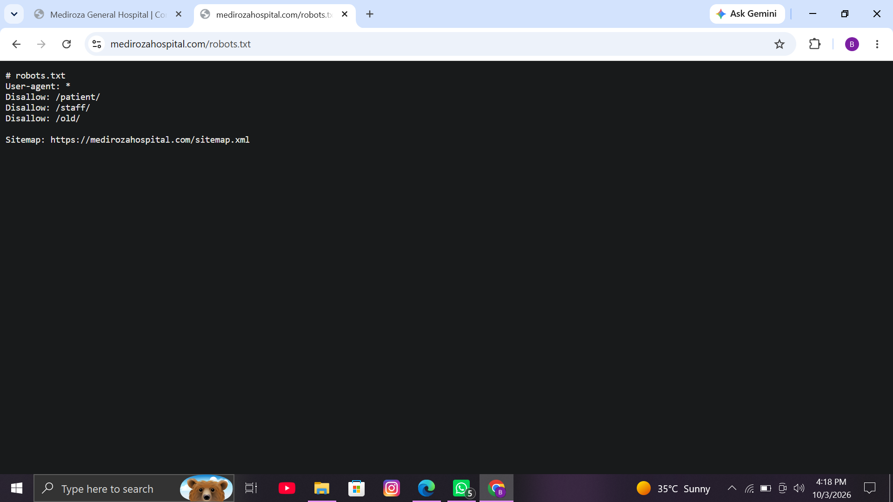
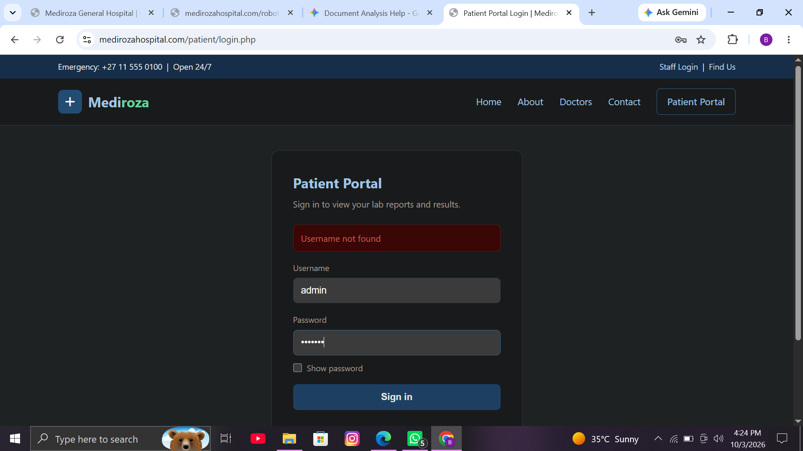
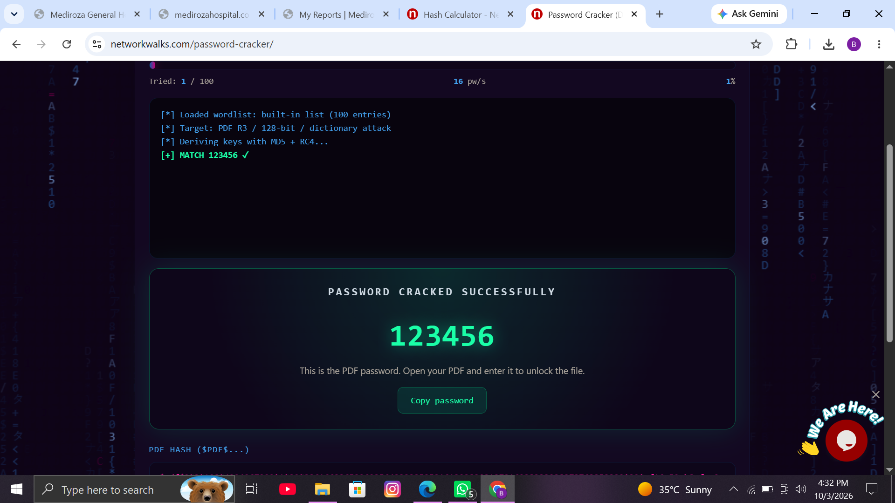
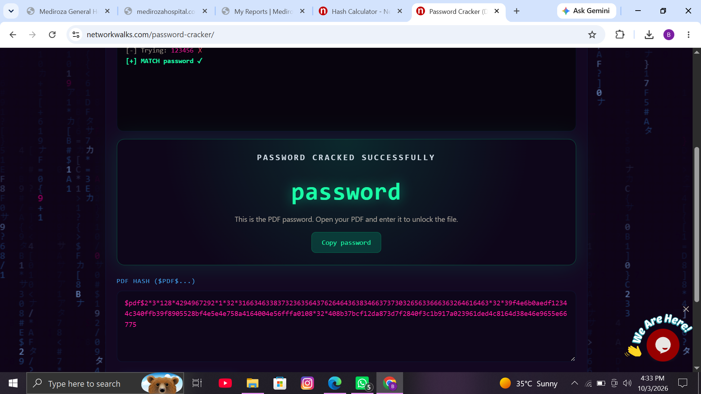
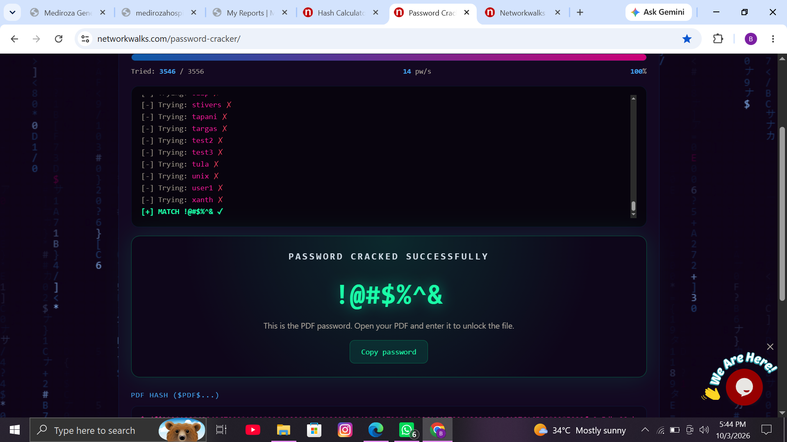

# Mediroza Hospital — Web Application Penetration Testing Assessment

This repository contains the full methodology, technical walkthrough, vulnerability analysis, and proof-of-concept evidence for an authorized **Black-Box Web Application Penetration Test** conducted on the Mediroza General Hospital patient portal.

---

## Executive Summary

As part of the **NETWORKWALKS Cybersecurity Training (Batch B082 - Week 4)**, an end-to-end security assessment was performed against the Mediroza General Hospital web infrastructure (`https://medirozahospital.com`). 

The primary goal was to evaluate the application's attack surface, bypass authentication controls via input manipulation, crack document encryption keys, analyze hidden file metadata, and identify critical database exposures.

---

## Authorization & Disclaimer

> **Notice:** This security assessment was conducted within a strictly authorized and controlled lab environment provided by **NETWORKWALKS**. All testing procedures follow ethical hacking principles. Unethical or unauthorized application of these techniques is illegal.

---

## Assessment Objectives & Scope

* **Reconnaissance:** Uncover hidden endpoints and restricted directories via web application crawlers and robot instructions.
* **Authentication Testing:** Assess login interfaces for user enumeration and SQL Injection (SQLi) vulnerabilities.
* **Document Security Analysis:** Evaluate PDF encryption algorithms and execute dictionary attacks on protected lab reports.
* **Deep Reconnaissance:** Extract file metadata to locate legacy backups and sensitive database dumps.
* **Risk Reporting:** Document findings with severity ratings and actionable mitigation strategies.

---

## Technical Methodology & Execution Phase

### Phase 1: Reconnaissance & Initial Access

#### 1. Endpoint Discovery via `robots.txt`
Inspecting the application's `/robots.txt` file revealed hidden directories disallowed for web crawlers, exposing `/patient/`, `/staff/`, and `/old/`.



#### 2. Username Enumeration Vulnerability
The login endpoint (`/patient/login.php`) provided explicit and inconsistent error responses, allowing an attacker to enumerate valid accounts.

* **Invalid Username Attempt:** Displays `Username not found`.
  

* **Testing Valid Account:**
  

* **Valid Account Confirmation:** Entering `admin` with a dummy password returns `Incorrect password`, confirming `admin` is a registered user.
  

#### 3. SQL Injection Login Bypass
Inputting a single quote (`admin'`) in the username field broke the backend database query, confirming SQL injection. Supplying `admin'` as the username bypassed authentication completely, granting full access to the patient portal and revealing encrypted reports (`patient_report_1.pdf`, `patient_report_2.pdf`, `patient_report_3.pdf`).

---

### Phase 2: PDF Encryption & Hash Recovery

The downloaded patient lab reports were protected with 128-bit encryption. Password hashes were extracted (`$pdf$...`) and subjected to dictionary attacks using custom and built-in wordlists.

#### 1. Report 1 Password Recovery
* **Password:** `123456`
  

#### 2. Report 2 Password Recovery
* **Password:** `password`
  

#### 3. Report 3 Password Recovery (Extended Dictionary Attack)
Default wordlists failed on the third report. Switching to the specialized **JTR wordlist** successfully recovered the complex key string.
* **Password:** `!@#$%^&`
  

---

### Phase 3: Deep Reconnaissance & Exploit Chaining

1. **Decryption:** The protected PDF was decrypted using `qpdf`:
   ```bash
   qpdf --password='!@#$%^&' --decrypt patient_report_3.pdf report3_open.pdf
2. **Metadata Analysis & Database Exposure:**
   * **Metadata Extraction:** Running `exiftool` on the decrypted PDF revealed the author (`j.malik`) and an embedded comment:
     > *"DB backup moved to /old before site migration, do not delete"*
   * **Directory Listing:** Navigating to `https://medirozahospital.com/old/` confirmed enabled directory listing, exposing `mediroza_db_backup_2019.sql`.
   * **Data Impact:** Downloading the raw `.sql` file exposed unencrypted staff records, administrator credentials (`j.malik`), monthly salary data, and shareholder percentages.

---

## Key Vulnerabilities & Risk Summary

| Finding ID | Vulnerability Description | Location / Path | Severity |
| :--- | :--- | :--- | :--- |
| **VULN-01** | SQL Injection (Authentication Bypass) | `/patient/login.php` | **CRITICAL** |
| **VULN-02** | Unrestricted Backup Exposure & Directory Listing | `/old/` | **CRITICAL** |
| **VULN-03** | Plaintext Confidential Data Disclosure | `/old/mediroza_db_backup_2019.sql` | **CRITICAL** |
| **VULN-04** | Weak PDF Document Encryption | `/patient/reports/` | **HIGH** |
| **VULN-05** | Sensitive Metadata Leakage in Distributable PDFs | `patient_report_3.pdf` | **MEDIUM** |
| **VULN-06** | Inconsistent Authentication Error (User Enumeration) | `/patient/login.php` | **MEDIUM** |

---

## Remediation & Security Recommendations

* **Parameterized Queries:** Use prepared statements (e.g., PDO or `mysqli` prepared statements) for all database operations to permanently patch SQL injection.
* **Disable Directory Browsing:** Turn off directory listing in the web server configuration (e.g., `Options -Indexes` in Apache).
* **Generic Error Messages:** Standardize login responses to `Invalid username or password` regardless of which credential fails.
* **Metadata Sanitization:** Integrate automated file stripping tools (`exiftool -all= filename.pdf`) into the document generation pipeline before publishing files.
* **Secure Storage:** Store database backups and sensitive exports outside the public web root (`/var/www/html/`).

---

## Tools Used

* **Web Assessment:** Browser Developer Tools, cURL, Burp Suite
* **Password Cracking:** Networkwalks Hash Calculator & Cracker, John the Ripper (JTR)
* **File Analysis & Decryption:** `exiftool`, `qpdf`, `wget`

## Assessment Metadata & Program Scope

* **Training Program:** Networkwalks Cybersecurity Career Track
* **Cohort / Batch:** Batch B082 (Week 4 Assessment)
* **Lead Mentor:** Sir Waqas Karim (CCIE)

---

## Legal Notice & Educational Scope

> **Warning:** This repository is maintained exclusively for academic, research, and professional portfolio demonstration. All security tests, vulnerability disclosures, and dynamic attacks demonstrated herein were executed inside an authorized sandbox environment operated by **Networkwalks**. Applying these assessment techniques against production assets or unauthorized endpoints without formal permission is strictly prohibited.
